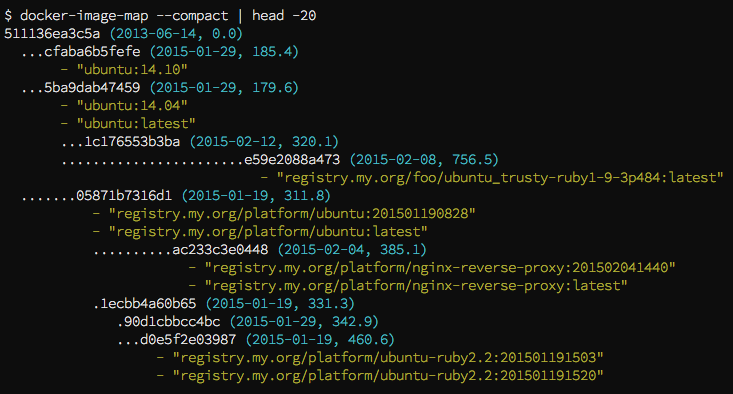

# docker-image-map

Visualize docker image history.

## Installation

    gem install docker-image-map

## Usage

    docker-image-map

## Contributing

* It's on [GitHub](https://github.com/mdub/docker_image_map)
